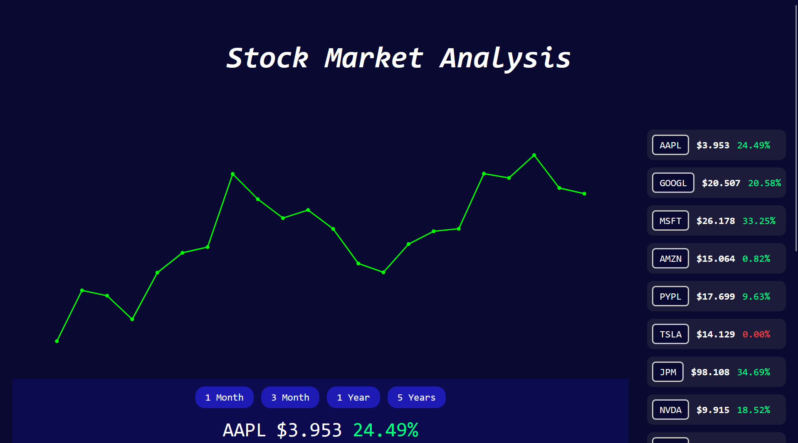

# 📈 Stock Chart Analysis Mini Project

A sleek and interactive mini web application for visualizing and analyzing stock data using **HTML**, **CSS**, and **JavaScript**. This project fetches real-time data from a stock API and displays charts, stock information, and summaries in a clean and user-friendly interface.

---

## 🚀 Features

- 📊 Interactive stock price chart (Plotly.js)
- 📈 View historical data across different ranges (1 Month, 3 Months, 1 Year, 5 Years)
- 💹 Clickable stock tickers to switch between companies
- 🧾 Live display of Book Value and Profit %
- 📝 Company description shown on selection
- 🎨 Smooth UI with hover effects and dynamic chart interactions

---

## 🛠️ Technologies Used

- **HTML** – Structure
- **CSS** – Styling and layout
- **JavaScript** – Logic and interactivity
- **[Plotly.js](https://plotly.com/javascript/)** – For rendering dynamic charts
- **REST API** – Backend API to fetch stock data

---

## 🌐 Live APIs Used

- `https://stocksapi-uhe1.onrender.com/api/stocks/getstockstatsdata` – Stock list and stats  
- `https://stocksapi-uhe1.onrender.com/api/stocks/getstocksdata` – Chart time series data  
- `https://stocksapi-uhe1.onrender.com/api/stocks/getstocksprofiledata` – Company summaries  

---

## 📸 Screenshots

"Live:" https://stock-chart-mini-project.netlify.app/

> Made with ❤️ using HTML, CSS & JavaScript